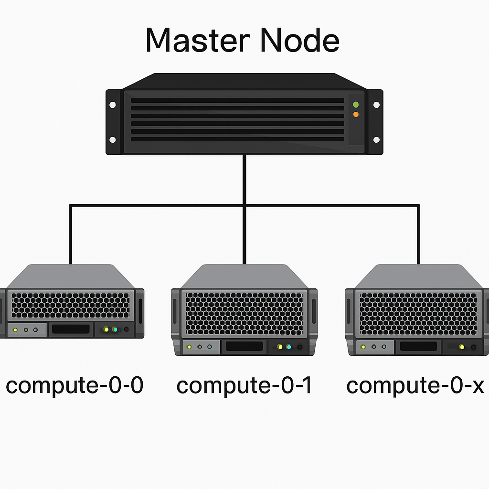

# EEHPC Cluster Details
The EEHPC Cluster is hosted by LEAP Lab in the Electrical Engineering building, Indian Institute of Science (IISc). 

# GPU Resource Availability

| **Node**      | **Number of GPUs** | **GPU Memory per GPU** |
|---------------|:------------------:|:----------------------:|
| compute-0-0   |         2          |        16 GB           |
| compute-0-1   |         2          |        16 GB           |
| compute-0-2   |         2          |        16 GB           |
| compute-0-3   |         2          |        16 GB           |
| compute-0-4   |         2          |        16 GB           |
| compute-0-6   |         3          |      11–16 GB          |
| compute-0-8   |         2          |        24 GB           |
| compute-0-5   |         3          |        48 GB           |
| compute-0-7   |         2          |        48 GB           |
| compute-0-9   |         3          |        48 GB           |

# Queue and GPU Resource Usage

| **Queue Name**     | **GPU Memory Eligibility** | **Max Jobs per User** | **Max Time Limit** | **GPU Usage Allowed** |
|--------------------|:-------------------------:|:--------------------:|:------------------:|:---------------------:|
| all.q (default)    | None                      | N/A                  | N/A                | No                    |
| short-gpu.q        | Up to 24 GB               | 6                    | 4 hours            | Yes                   |
| gpu.q              | Up to 16 GB               | 6                    | 2 days             | Yes                   |
| med-gpu.q          | 24–48 GB                  | 3                    | 4 days             | Yes                   |
| long-gpu.q         | 48 GB                     | 3                    | 7 days             | Yes                   |

> **Note:**  
> By default, `all.q` is launched and it will **not** use GPU resources.

# Important points

Important points:

1.⁠ ⁠We now have four disk spaces: /export (roughly saying, /home), /data1/, /data2/, /data3/ with about 51 TB, 28 TB, 28 TB and 16 TB respectively. Among them, the speed of data read-write should be export > data1 >> data2 ~ data3. 
2.⁠ ⁠⁠Your primary working directory hence would be /home/<username> which will offer largest storage now and fastest speed too. However, we are going to set user storage limits soon, which will be declared in due course.
3.⁠ ⁠⁠data2 and data3 should be used for large files with no near future uses. Anything inactive should be moved from /home other spaces.
4.⁠ ⁠⁠Exact distinction of storages in data1, data2 and data3 will be advised soon. Accounts in /data1, /data2 and /data3 are only granted based on one’s need for extra storage later.
5.⁠ ⁠⁠One common base conda environment should be visible to you as and when you login. If you don’t see ‘base’ beside your username after logging in, let me know. 
6.⁠ ⁠⁠For GPU hobs too, one starter environment name pytorch2 is activated. Everyone try them using conda activate pytorch2 after you login. Let me know if it does not activate for any of you. For starying days, if you see common packages are not there in those two environments, let me know. I will install them.
7.⁠ ⁠⁠For more custom requirements, feel free to create your own specific conda environments.
---

> **Warning**
>
> Any user who violates the rules puts all other user jobs under crash-risk.  
> When identified, we will follow a two-tier warning system:
> - **Yellow flag:** Stern warning  
> - **Red flag:** User privileges removed or restricted

---
